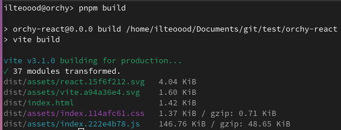
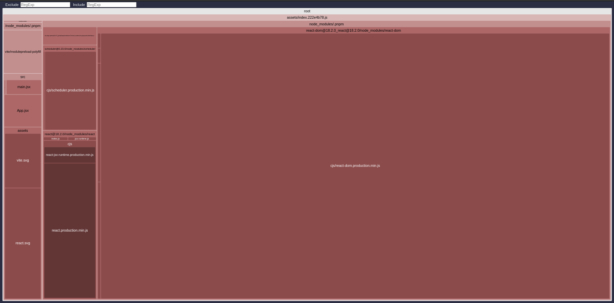
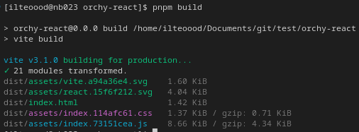
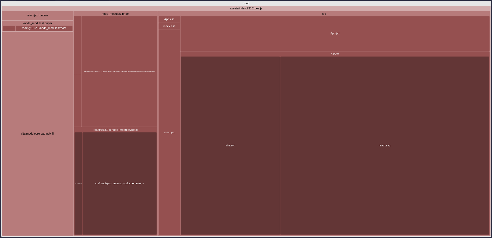

# Import maps: the easy way

As [previously defined](../wc-configuration/common#commonimportmap), with `import maps` we can define at runtime which source will be used to load a specific module.

In this tutorial we will see how to configure a template to use them, and which advantages we can achieve.

## Template preparation

Let's apply them to a fresh React template!

Firstly, scaffold it using the `create-orchy-mfe` tool:

```bash
npx create-orchy-mfe -t react -d ./ -T=false -n orchy-react
```

:::info
Although the command above you will scaffold a **JavaScript React** template, this tutorial is still valid for all the other templates.
:::

Secondly, you must enter in the project folder and install the dependencies:
```bash
cd orchy-react && pnpm i
```

Thirdly, invoke the `build` script, to have a production-ready build of the template.
```bash
pnpm build
```

## Build: an artifact problem

Take a look at the `build` command result, if you have done everything correctly you should have a similar result:



As you can see, there is a `.js` file which size is ~147 KB. A little bit heavy for an "hello world", isn't it?

To understand the reasons behind these values, open the `stats.html` file in the root folder of your template.



There, you can find that `react-dom` fit the ~85% of the entire bundle, for a total of ~130 KB.

`react` and `react-dom` are always embedded in each React Micro Frontend, so you are going to download them multiple times.

There, `import maps` comes to the rescue!

## Externalize repeated dependencies

To allow `import maps` to load dependencies just once, we **must** extract them from the final bundle.

This is an action that can be done at build time, configuring properly your bundler: for `orchy` templates, it is always [Vite](https://vitejs.dev).


Open the `vite.config.js` file, and add the following configuration:

```javascript
build: {
  rollupOptions: {
    external: [
      'react',
      'react-dom',
    ]
  }
}
```

Then, execute again the `build` script.



This time, it's execution time will be faster and also it will produce lighter static files.

To better verify the output, open once again the `stats.html` file:



You will that the references to `react` and `react-dom` are gone.

## Inject dependency at runtime

Now, it's time to configure `import maps`.

In your [`orchy` configuration file](../wc-configuration/common.md), you only have to add the following configuration:

```json
"importMap": {
  "imports": {
    "react": "https://esm.sh/react@18.2.0",
    "react-dom": "https://esm.sh/react-dom@18.2.0"
  }
}
```

And everything will start to work as always did.

## Conclusion

This procedure allows you to inject the extracted dependencies **only once**, at runtime.

:::info
`Import maps` works only with [JavaScript modules](https://developer.mozilla.org/en-US/docs/Web/JavaScript/Guide/Modules), that's why we use `esm.sh` as [CDN](https://developer.mozilla.org/en-US/docs/Glossary/CDN).
:::